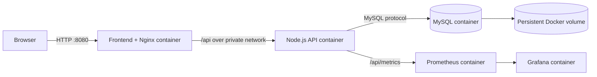

# MessMate Virtualization and Cloud Computing Project Plan

## Project title

**Containerized MessMate: A Cloud-Ready Multi-Service Deployment with Monitoring and Recovery**

## Goal

Extend the existing MessMate application into a reproducible cloud-computing project without changing its working business logic. The coursework version will demonstrate:

- OS-level virtualization with Docker containers;
- separation of frontend, API, and database services;
- private service networking and a single public entry point;
- persistent database storage;
- health checks and dependency-aware startup;
- metrics collection and an operational dashboard;
- automated image validation in CI;
- backup, restore, deployment, and failure-recovery procedures.

The existing Vercel, Render, and TiDB deployment remains the stable product. All coursework changes live on `codex/cloud-virtualization-coursework`.

## Why this scope

This project is large enough to demonstrate real virtualization and cloud concepts, but small enough to implement and explain before a close deadline. It reuses the tested MessMate application instead of inventing unrelated functionality.

Kubernetes is deliberately a stretch goal. A correct Docker Compose system with isolation, persistence, monitoring, CI, and documented recovery is stronger than incomplete Kubernetes manifests that cannot be demonstrated.

## Target architecture



Only the Nginx frontend and, when enabled, Grafana are exposed to the host. The API and database communicate through an internal Docker network. Nginx serves the Vite build, provides SPA fallback behavior, and reverse-proxies `/api` to the backend so cookie authentication remains same-origin.

## Technology choices

| Concern | Choice | Reason |
| --- | --- | --- |
| Container runtime | Docker Desktop | Already installed and easy to demonstrate |
| Local orchestration | Docker Compose | Reproducible multi-service startup without unnecessary cluster complexity |
| Frontend image | Multi-stage Node build + Nginx runtime | Small runtime image and clear build/runtime separation |
| API image | Production Node image running as a non-root user | Matches the existing Express application while improving isolation |
| Coursework database | MySQL 8 container | Compatible with the existing `mysql2` data layer and self-contained for assessment |
| Persistent storage | Named Docker volume | Survives container recreation |
| Metrics | `@prometheus-io/client`, Prometheus, Grafana | Demonstrates application and infrastructure observability with familiar tools |
| CI | GitHub Actions | Automatically validates builds and container definitions |
| Optional cloud host | One Ubuntu VM running Docker Compose | Demonstrates the relationship between VM virtualization and container virtualization |

## Implementation phases

### Phase 1 — Containerize the application

Estimated focused time: **2–3 hours**

Deliverables:

- `frontend/Dockerfile` with a multi-stage Vite build and Nginx runtime;
- `frontend/nginx.conf` with SPA routing and `/api` reverse proxy;
- `backend/Dockerfile` with production-only dependencies and a non-root process;
- root `.dockerignore` files or service-specific ignore files;
- container health checks;
- local image builds for both services.

Acceptance checks:

```powershell
docker build -t messmate-frontend ./frontend
docker build -t messmate-api ./backend
```

Both images must build without copying `.env`, `node_modules`, Git history, or development-only files into their runtime layers.

### Phase 2 — Compose the complete system

Estimated focused time: **2–3 hours**

Deliverables:

- `compose.yaml` for frontend, API, and MySQL;
- `.env.docker.example` containing safe placeholders only;
- MySQL initialization using the consolidated `database/schema.sql`;
- named database volume;
- public and private Docker networks;
- health-based startup dependencies;
- optional development seed profile, disabled by default.

Acceptance checks:

```powershell
docker compose config
docker compose up --build -d
docker compose ps
Invoke-RestMethod http://localhost:8080/api/health
```

The browser must load at `http://localhost:8080`, authentication requests must use `/api`, and restarting containers must not delete database records.

### Phase 3 — Add observability

Estimated focused time: **2 hours**

Deliverables:

- a protected or internally exposed Prometheus metrics endpoint;
- request count, response duration, process, and database-health metrics;
- Prometheus configuration;
- Grafana provisioning with a MessMate dashboard;
- Compose `observability` profile so monitoring is optional.

Acceptance checks:

```powershell
docker compose --profile observability up -d
docker compose ps
```

Grafana must show live API traffic and health information after the user exercises MessMate. Metrics must not expose credentials, tokens, email addresses, transaction references, or feedback text.

### Phase 4 — Backup and recovery

Estimated focused time: **1 hour**

Deliverables:

- PowerShell backup script using `mysqldump` inside the database container;
- restore script with explicit confirmation and target validation;
- timestamped backup directory excluded from Git;
- documented container-failure and database-recovery exercise.

Acceptance checks:

1. Create a test record through the application.
2. Create a backup.
3. Recreate the application containers and verify the record persists through the named volume.
4. Restore into a disposable test database and verify the record exists.

Production TiDB data will never be used for this exercise.

### Phase 5 — Continuous integration

Estimated focused time: **1–2 hours**

Deliverables:

- GitHub Actions workflow for frontend lint/build;
- backend production dependency installation and audit;
- Docker image builds;
- Compose configuration validation;
- optional image publication to GitHub Container Registry only if repository permissions are available.

Acceptance checks:

Every push to the coursework branch must either pass all checks or show a specific failing step. Secrets are not required for build validation.

### Phase 6 — Report and demonstration package

Estimated focused time: **1–2 hours**

Deliverables:

- architecture diagram and component table;
- setup and teardown commands;
- screenshots of containers, health endpoint, application, Prometheus, and Grafana;
- short explanation of VM versus container virtualization;
- failure-recovery demonstration;
- limitations and future Kubernetes path;
- five-minute viva/demo script.

## Fast completion order

If time becomes extremely limited, complete work in this order:

1. Dockerfiles and Nginx configuration.
2. Three-service Compose stack with persistence and health checks.
3. Working browser/API demonstration.
4. Documentation and screenshots.
5. Prometheus and Grafana.
6. CI workflow.
7. Backup and restore exercise.
8. Kubernetes only if everything above is complete.

The first four items form the minimum defensible submission. Items five through seven turn it into a strong cloud-computing project.

## Optional Phase 7 — VM or Kubernetes extension

Do this only after the core submission works.

### Option A: Ubuntu cloud VM — recommended extension

- create one free-tier or college-provided Ubuntu VM;
- allow inbound HTTP only, plus restricted SSH;
- install Docker Engine and the Compose plugin;
- clone the coursework branch;
- provide secrets through an untracked environment file;
- run the same Compose stack;
- document security-group rules and the public health check.

This directly demonstrates a virtual machine hosting multiple isolated containers and is easier to explain than a local-only Kubernetes cluster.

### Option B: Local Kubernetes — stretch extension

- deploy frontend, API, and MySQL to Docker Desktop Kubernetes or Minikube;
- use ConfigMaps for non-secret configuration and Secrets for credentials;
- add readiness/liveness probes, Services, persistent volume claims, and an Ingress;
- demonstrate a rolling API deployment and pod self-healing.

Do not place real production secrets in Kubernetes YAML.

## Security boundaries

- Never commit `.env`, TiDB credentials, Brevo keys, Google OAuth secrets, Gemini keys, JWT secrets, dumps, or production customer data.
- Use dedicated local coursework credentials.
- Keep the database off the public host network.
- Run application containers as non-root where practical.
- Pin major image versions and document image sources.
- Keep `/api/health` free of secret details.
- Keep the existing hosted production deployment unchanged.

## Evidence to collect for submission

- `docker compose ps` showing healthy services;
- browser screenshot of the containerized application;
- `/api/health` response through Nginx;
- Docker volume and network inspection;
- Grafana dashboard under generated traffic;
- successful GitHub Actions run;
- backup and recovery output with non-sensitive sample data;
- one controlled failure showing restart or health-check behavior.

## Viva-ready explanation

“MessMate already used managed cloud services, but this coursework branch makes the deployment portable and demonstrates virtualization explicitly. The frontend, API, and database run in isolated containers with a private network and persistent storage. Nginx is the single public entry point and preserves same-origin authentication. Health checks coordinate startup, Prometheus and Grafana provide observability, and CI verifies that the images remain buildable. The same Compose deployment can run locally or inside an Ubuntu cloud VM, showing how containers operate on top of virtual-machine infrastructure.”

## Immediate next task

Implement Phase 1 and the minimum Phase 2 skeleton together, then run the first end-to-end container build before adding monitoring.
