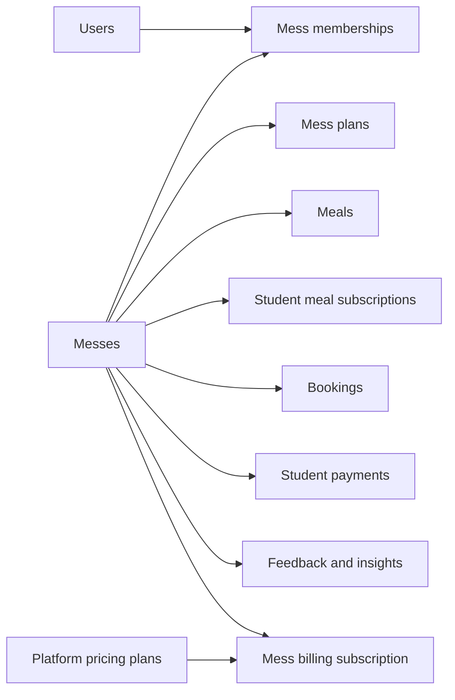
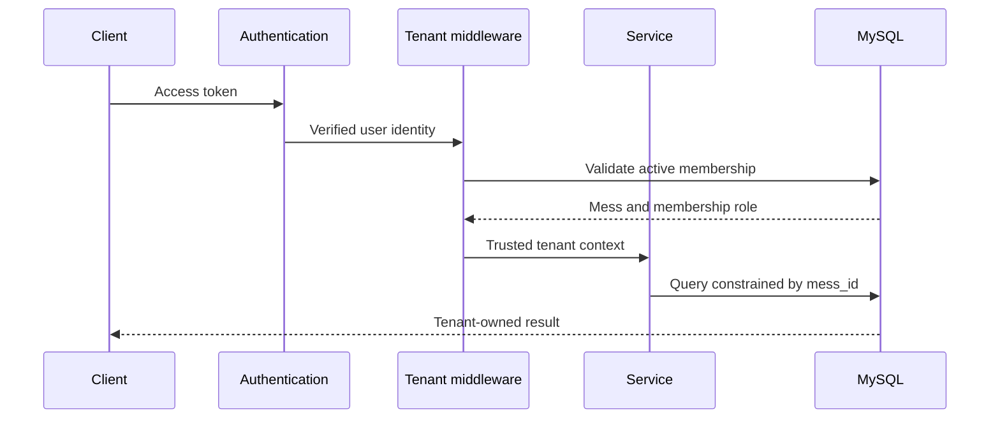

# Future Multi-Mess SaaS Roadmap

Status: future development proposal. None of the multi-mess or platform-billing behavior in this document is implemented yet.

## 1. Current Product Boundary

MessMate currently supports one mess operating in one shared application instance.

- `users.role` is global and contains `student` or `admin`.
- There is no `messes` table, tenant identifier, or mess-membership model.
- Meals and mess plans are globally visible.
- The meal uniqueness rule is global: one breakfast, lunch, and dinner per date.
- `created_by` records the administrator who created a meal or plan, but it is audit information rather than a tenant boundary.
- Student registration is public. One administrator is provisioned as the bootstrap account, and that administrator can invite additional administrators by email.

This is an intentional scope decision for the current portfolio version. It keeps the completed workflows focused on the relationship between one mess and its customers.

### Implemented improvement within the single-mess scope

Administrator onboarding has been improved before multi-tenancy:

1. Keep one existing administrator as the bootstrap administrator.
2. Add an authenticated **Team and access** page available only to administrators.
3. Let an administrator invite another administrator by email.
4. Store only a hash of the single-use invitation token, its intended role, inviter, expiry, and accepted timestamp.
5. Let the recipient accept through password registration or an authenticated Google account whose verified email matches the invitation.
6. Create the administrator account only after valid invitation acceptance; never accept a public `role` field during registration.
7. Reuse the existing forgot-password flow after the account exists.

This uses an `admin_invitations` table without pretending that tenant ownership exists. Its service and UI use terminology that can later migrate to `mess_invitations` and membership roles.

## 2. Target Product

The future product would become a multi-tenant SaaS platform:

- Independent mess businesses register and manage their own workspace.
- Each mess has owners, administrators, staff, and student/customer memberships.
- One user identity can belong to more than one mess.
- Every operational record belongs to exactly one mess.
- Mess businesses pay MessMate for access to the software.
- Students continue to buy meal subscriptions from a particular mess.

These two commercial relationships must remain separate:

1. **Meal subscription:** a student pays a mess for meals. This is the existing `subscriptions` domain.
2. **Platform billing subscription:** a mess pays MessMate to use the management software. This would be a new billing domain such as `mess_billing_subscriptions`.

## 3. Proposed Domain Model

### Core tables

#### `messes`

- `mess_id`
- `name`
- `slug`
- `status`: `trialing`, `active`, `past_due`, `suspended`, or `closed`
- `timezone`
- `contact_email`
- timestamps

#### `mess_memberships`

- `membership_id`
- `mess_id`
- `user_id`
- `role`: `owner`, `admin`, `staff`, or `student`
- `status`: `invited`, `active`, `suspended`, or `removed`
- timestamps
- unique `(mess_id, user_id)`

User identity remains global. Authorization becomes membership-specific. A separate global `platform_admin` capability should be reserved for operating MessMate itself and must not be confused with a mess administrator.

#### `mess_invitations`

- hashed single-use invitation token
- `mess_id`
- invited email
- intended role
- inviter membership
- expiry and accepted timestamps

#### Tenant-owned operational records

Add `mess_id` to plans, meals, student meal subscriptions, bookings, payments, skips, feedback, and AI insight runs. Although some records can infer the mess through joins, explicit tenant ownership makes authorization, indexing, auditing, and defensive database constraints clearer.

Important uniqueness rules become tenant-aware. For example:

- meals: unique `(mess_id, meal_date, meal_type)`
- plan names, if required: unique `(mess_id, plan_name)`
- membership: unique `(mess_id, user_id)`

Composite foreign keys or transactional validation should prevent records from different messes being accidentally connected.

## 4. Mess and Administrator Onboarding

### First owner

1. A visitor selects **Register your mess**.
2. They enter mess details and create an account or authenticate with Google.
3. Email ownership is verified.
4. One database transaction creates the mess and its first `owner` membership.
5. A trial or selected platform plan is attached.
6. The owner enters the new workspace and completes setup.

The public endpoint must never accept an unrestricted `role: admin` value. The backend assigns the first owner only as part of the controlled mess-creation transaction.

### Additional administrators

1. An owner opens **Team and access**.
2. The owner invites an email address and chooses an allowed role.
3. MessMate emails a short-lived, single-use invitation.
4. The recipient signs in, registers, or links Google.
5. The invitation creates or activates the membership for that mess only.

Only owners should manage other owners. The final active owner cannot leave or be removed until ownership is transferred.

## 5. Tenant Context and Isolation

Authentication answers **who is the user?** Tenant isolation additionally answers **which mess may this request access?** An authenticated administrator must never gain access to another mess merely because they hold an admin role somewhere.

The future request flow should be:

Implementation rules:

- Resolve the active mess through trusted server-side membership data.
- Never trust a client-provided `mess_id` without validating membership.
- Apply tenant scope through shared middleware/repository helpers, not repeated optional controller conditions.
- Include `mess_id` in relevant indexes and uniqueness constraints.
- Reject cross-tenant foreign-key combinations.
- Scope exports, reports, cached values, background jobs, files, AI prompts, logs, and rate limits—not only CRUD endpoints.
- Add automated negative tests proving that valid users from Mess A cannot read or mutate Mess B data.

AWS describes tenant isolation as separate from ordinary authentication and authorization: an authenticated user can still cross a tenant boundary unless every resource access is constrained by tenant context. See [AWS SaaS tenant isolation fundamentals](https://docs.aws.amazon.com/whitepapers/latest/saas-architecture-fundamentals/tenant-isolation.html).

## 6. Platform Billing: Mess Pays MessMate

### Proposed tables

#### `platform_plans`

- plan name and billing interval
- provider price identifier
- limits such as administrators, active students, data retention, and AI insight usage
- feature flags/entitlements
- active status

#### `mess_billing_customers`

- `mess_id`
- billing provider customer identifier
- billing email

#### `mess_billing_subscriptions`

- `mess_id`
- billing provider subscription identifier
- platform plan identifier
- status
- current billing period start/end
- cancel-at-period-end flag
- trial end

#### `billing_webhook_events`

- unique provider event identifier
- event type
- received/processed timestamps
- processing result

This supports idempotency so repeated webhook delivery does not activate, suspend, or invoice a mess twice.

### Billing lifecycle

1. The mess owner selects a platform plan.
2. The payment provider collects payment details; MessMate never stores raw card details.
3. The provider creates the customer and subscription.
4. Signed webhook events update the local billing projection.
5. Backend authorization checks local entitlements before allowing paid functionality.
6. Failed or overdue payments enter a defined grace period before restricted access.
7. Cancellation normally takes effect at the end of the paid period.

Access should not be granted solely because the browser returned from a successful checkout page. The backend should confirm subscription state using signed, idempotently processed webhook events. Stripe's documented subscription lifecycle likewise treats subscription status and webhook events as the basis for provisioning access. See [Stripe subscription lifecycle](https://docs.stripe.com/billing/subscriptions/overview) and [subscription webhooks](https://docs.stripe.com/billing/subscriptions/webhooks).

### Example commercial tiers

These are product hypotheses, not current promises or implemented limits:

- Trial: evaluation period with bounded usage.
- Starter: core meals, plans, bookings, subscriptions, and payment verification.
- Operations: multiple admins, exports, richer analytics, and higher limits.
- Intelligence: AI feedback analysis and advanced reporting.

Entitlements should be represented as named capabilities rather than scattered checks against plan names. This allows pricing to change without rewriting business logic. Stripe documents the same separation through features and active entitlements: [Stripe Billing Entitlements](https://docs.stripe.com/billing/entitlements).

## 7. Migration from the Current Application

The migration must preserve all existing data.

### Phase 0 — Improve current administrator provisioning (implemented)

- Add single-mess administrator invitations and acceptance.
- Record inviter, expiry, acceptance, cancellation, and audit information.
- Prevent public privilege selection and invitation replay.
- Keep the bootstrap administrator recoverable through documented operational procedures.

### Phase A — Prepare

- Create the new mess, membership, invitation, and platform-billing tables.
- Insert one default mess representing the current installation.
- Give every existing admin an admin/owner membership in that mess.
- Give every existing student a student membership.

### Phase B — Add ownership

- Add nullable `mess_id` columns to tenant-owned tables.
- Backfill every current record with the default mess.
- Validate that no record remains unowned.
- Make `mess_id` non-null and add foreign keys/indexes.
- Replace global uniqueness rules with tenant-aware rules.

### Phase C — Enforce isolation

- Introduce tenant-context middleware.
- Convert every repository query to require trusted tenant context.
- Add cross-tenant authorization and foreign-key tests.
- Update JWT/session behavior to support the selected mess without trusting stale membership claims indefinitely.

### Phase D — Add onboarding

- Mess registration and initial-owner creation.
- Team invitations, acceptance, role changes, and ownership transfer.
- Student join links/codes and workspace switching.

### Phase E — Add platform billing

- Provider checkout and customer portal.
- Signed webhook processing with event idempotency.
- Local subscription projection and entitlements.
- Grace-period, suspension, reactivation, and cancellation behavior.

### Phase F — Operate safely

- Tenant-scoped observability and audit logs.
- Per-tenant quotas and abuse controls.
- Database backup/restore testing.
- Data export and mess deletion/retention policy.
- Load tests and noisy-neighbor monitoring.

## 8. Required Test Categories

- Mess A cannot read, update, approve, export, or delete Mess B records.
- Changing a URL identifier cannot cross a tenant boundary.
- A user with memberships in two messes sees the correct active context.
- An admin in one mess may remain a student in another.
- Duplicate webhook events are harmless.
- Failed billing does not immediately destroy operational data.
- A suspended mess cannot bypass restrictions through older tokens or direct API requests.
- The last owner cannot be removed accidentally.
- Invitation tokens expire, are stored hashed, and cannot be replayed.
- Current single-mess data survives backfill without changed totals or relationships.

## 9. Definition of Done

The application is not multi-tenant merely because a `mess_id` column exists. This roadmap is complete only when onboarding, tenant-aware authorization, query scoping, database constraints, background work, billing state, observability, and negative isolation tests consistently enforce the same tenant boundary.
